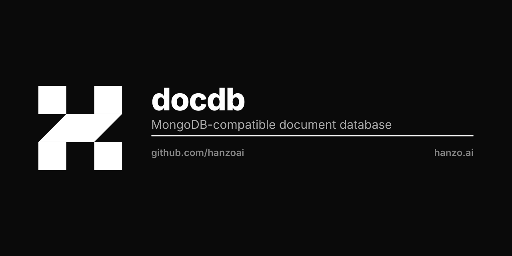
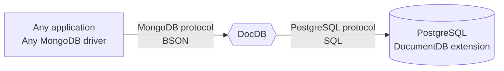

<p align="center"></p>

# DocDB

[](https://pkg.go.dev/github.com/hanzoai/docdb/docdb)

DocDB is an open-source alternative to MongoDB.
It is a proxy that converts MongoDB 5.0+ wire protocol queries to SQL
and uses PostgreSQL with [DocumentDB extension](https://github.com/documentdb/documentdb) as a database engine.



## Why do we need DocDB?

MongoDB was originally an eye-opening technology for many of us developers,
empowering us to build applications faster than using relational databases.
In its early days, its ease-to-use and well-documented drivers made MongoDB one of the simplest database solutions available.
However, as time passed, MongoDB abandoned its open-source roots;
changing the license to [SSPL](https://www.mongodb.com/legal/licensing/server-side-public-license) - making it unusable for many open-source and early-stage commercial projects.

Most MongoDB users do not require any advanced features offered by MongoDB;
however, they need an easy-to-use open-source document database solution.
Recognizing this, DocDB is here to fill that gap.

## Scope and current state

DocDB is compatible with MongoDB drivers and popular MongoDB tools.
It functions as a drop-in replacement for MongoDB 5.0+ in many cases.
Features are constantly being added to further increase compatibility and performance.

We welcome all contributors.
See our [contributing guidelines](CONTRIBUTING.md).

## Quickstart

DocDB stores nothing itself, so it needs a PostgreSQL with the DocumentDB
extension to store into. Start one, choosing a `<username>` and `<password>`:

```sh
docker run -d --rm --name docdb-postgres -p 5432:5432 \
  -e POSTGRES_USER=<username> \
  -e POSTGRES_PASSWORD=<password> \
  -e POSTGRES_DB=postgres \
  ghcr.io/ferretdb/postgres-documentdb-dev:17-ferretdb
```

Then run DocDB against it:

```sh
go run ./cmd/docdb \
  --postgresql-url='postgres://<username>:<password>@127.0.0.1:5432/postgres' \
  --listen-addr=127.0.0.1:27017
```

Connect any MongoDB client application with the URI
`mongodb://<username>:<password>@127.0.0.1:27017/`, or run `mongosh` against
the same URI. For PostgreSQL, `docker exec -it docdb-postgres psql -U <username> postgres`.

Stop the database with `docker stop docdb-postgres`; it keeps its data in the
container and loses it on shutdown, which is what makes it a quickstart and
not a deployment.

DocDB is also a [Go library package](https://pkg.go.dev/github.com/hanzoai/docdb/docdb)
that embeds into your application; `docdb/docdb_test.go` is a worked example.

## Building and packaging

<!-- textlint-disable one-sentence-per-line -->

> [!NOTE]
> We advise users not to build DocDB themselves.
> Instead, use binaries, Docker images, or packages provided by us.

<!-- textlint-enable one-sentence-per-line -->

DocDB could be built as any other Go program,
but a few generated files and build tags could affect it.
See [there](https://pkg.go.dev/github.com/hanzoai/docdb/v2/build/version) for more details.

## Managed DocDB

Hanzo runs DocDB as a managed instance. See <https://hanzo.ai/docdb>.

## Community

- Website: <https://hanzo.ai/docdb>.
- [GitHub Discussions](https://github.com/hanzoai/docdb/discussions) for longer topics.
- [GitHub Issues](https://github.com/hanzoai/docdb/issues) for bugs and missing features.
